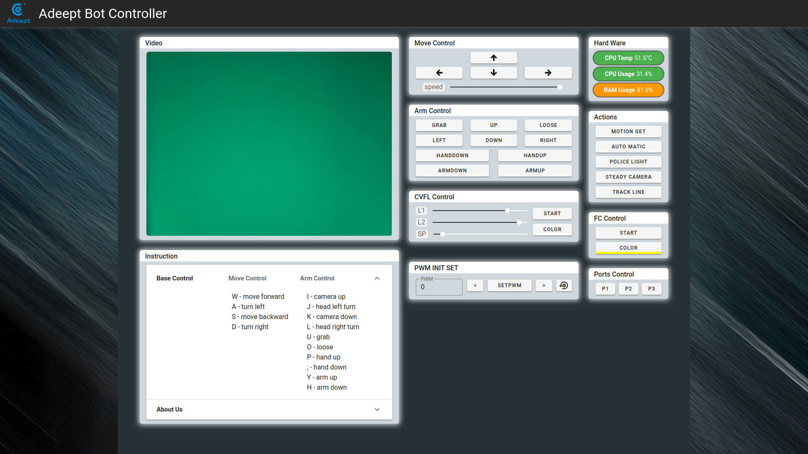

# Adeept AWR

This repository contains example code for the Adeept AWR 4WD WiFi Smart Robot Car Kit, compatible with Raspberry Pi 4/3 Model B+/B/2B. Designed as a DIY project for both kids and adults, this robot kit includes OpenCV target tracking functionality. For more details, visit the [product page](https://www.adeept.com/adeept-awr-4wd-wifi-smart-robot-car-kit-for-raspberry-pi-3-model-b-b-2b-diy-robot-kit-for-kids-and-adults-opencv-target-tracking_p0122_s0033.html).

This project is a fork of the original repository: https://github.com/adeept/Adeept_AWR.

You can view the Changelog [here](https://github.com/51moon/Adeept_AWR/blob/main/CHANGELOG.md).

## Web application preview

